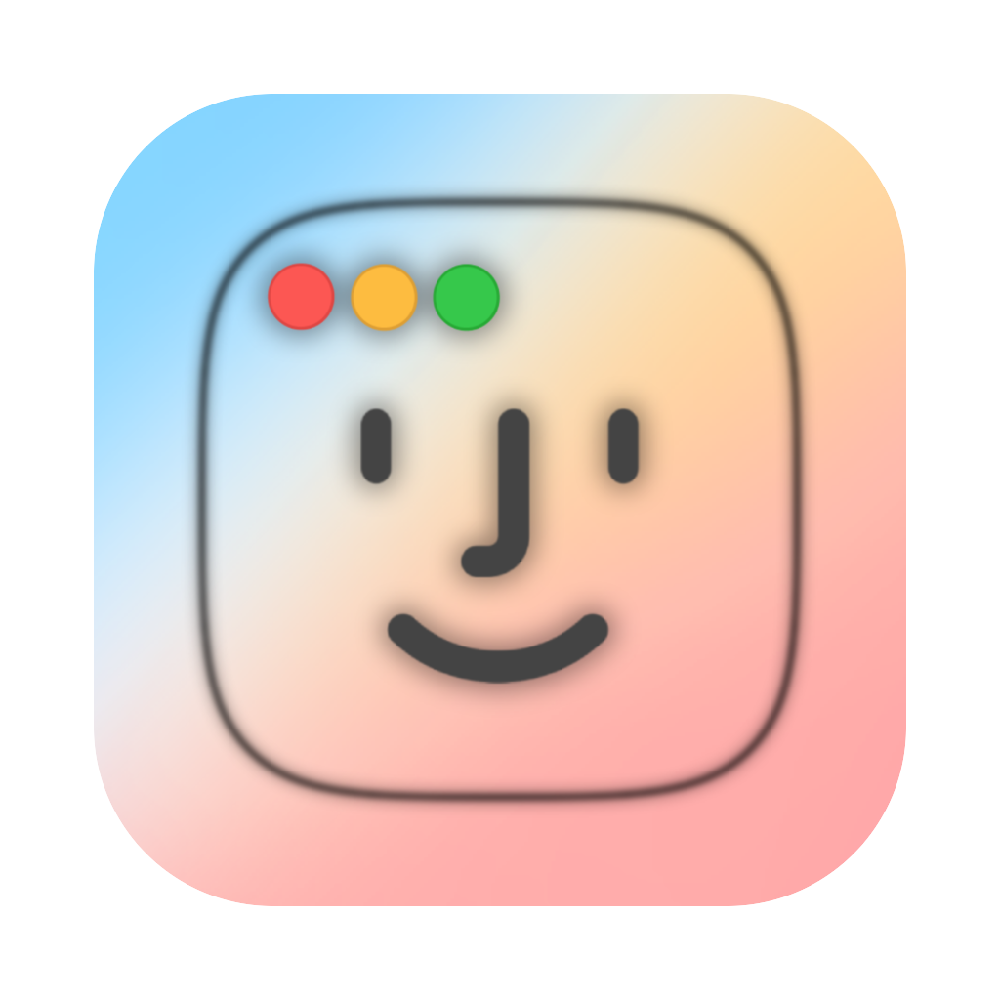

<h1 align="center">DockDoor</h1>

  
  

Effortless Alt+Tab switching and dock previews that respect your privacy.

## Table of Contents

  <ol>
    <li><a href="#about-the-project">About The Project</a></li>
    <li><a href="#features">Features</a></li>
    <li><a href="#contributing">Contributing</a></li>
    <li><a href="#license">License</a></li>
  </ol>

## About The Project

**Dockdoor** reintroduces the missing "Window Peeking" functionality to macOS, inspired by the utility found in Windows and Linux environments.

While the native macOS Dock is iconic, it often lacks context when multiple windows of the same application are open. Dockdoor solves this by allowing you to visualize, manage, and switch between your open windows simply by hovering over your Dock icons.

Built entirely open-source, Dockdoor is designed to feel like a native extension of the operating system. Fast, lightweight, and seamlessly integrated!

For full details, features, and documentation, please visit **[dockdoor.net](https://dockdoor.net)** ⭐

<a href="#readme-top">Back to top ⬆️</a>

## Features

### Dock Previews

### Alt+Tab Switching

### Cmd+Tab Enhancements

### Dock Preview Layouts

### Window Switcher Layouts

### Calendar Integration

### Compact List View

### Enhanced Previews

### For more awesome features please visit **[dockdoor.net](https://dockdoor.net)** ⭐

<a href="#readme-top">Back to top ⬆️</a>

## Contributing

- ⭐ [Star on Github: Help others discover DockDoor](https://github.com/ejbills/DockDoor)

- 🐛 [Report Issues: Help us improve the app](https://github.com/ejbills/DockDoor/issues)

- 🌍 [Help Translate: Make DockDoor global](https://crowdin.com/project/dockdoor)

<a href="#readme-top">Back to top ⬆️</a>

## License

This project is licensed under the GNU General Public License v3.0 - see the [LICENSE](LICENSE) file for details.

<a href="#readme-top">Back to top ⬆️</a>

