

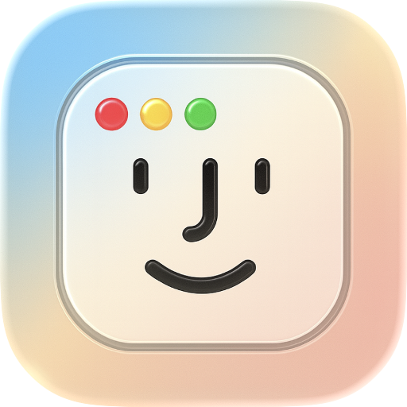

<h1 align="center">DockDoor</h1>

  
  

**Every window, one hover away.**

Live window previews, Alt+Tab switching and keyboard controls for the Dock you already have.

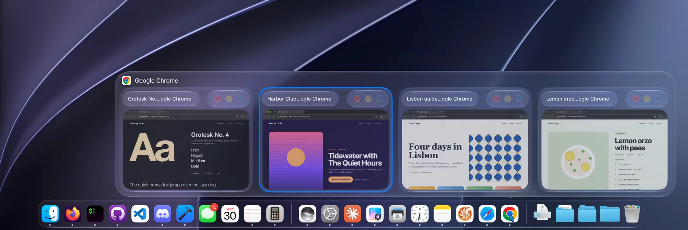

## Table of Contents

  <ol>
    <li><a href="#about-the-project">About The Project</a></li>
    <li><a href="#install">Install</a></li>
    <li><a href="#features">Features</a></li>
    <li><a href="#privacy">Privacy</a></li>
    <li><a href="#dockdoor-pro">DockDoor Pro</a></li>
    <li><a href="#contributing">Contributing</a></li>
    <li><a href="#license">License</a></li>
  </ol>

## About The Project

**DockDoor** brings window previews to the macOS Dock, the way Windows and Linux have had them for years. Hover an app in the Dock to see all of its open windows as live thumbnails, then click one to switch to it, or close, minimize and quit it right from the preview.

It doesn't replace the Dock. DockDoor is a small native app that runs from the menu bar and adds to the Dock that ships with macOS, in Liquid Glass on macOS 26 and later.

See it in motion at **[dockdoor.net](https://dockdoor.net)**.

<a href="#readme-top">Back to top ⬆️</a>

## Install

- **[Download DockDoor.dmg](https://github.com/ejbills/DockDoor/releases/latest/download/DockDoor.dmg)**
- Or with Homebrew: `brew install --cask dockdoor`

Free for macOS 13 Ventura and later, on Apple silicon and Intel. Notarized by Apple, and it keeps itself up to date.

Only download DockDoor from [dockdoor.net](https://dockdoor.net) or this repository's [releases](https://github.com/ejbills/DockDoor/releases).

<a href="#readme-top">Back to top ⬆️</a>

## Features

### Dock previews

Hover any app in the Dock to see its windows, including ones on other desktops, other displays, and minimized or hidden ones. Each preview has close, minimize, full screen and quit buttons, and a middle-click closes a window without switching to it.

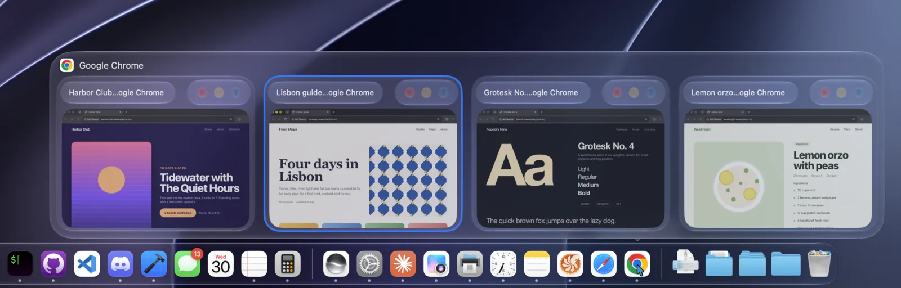

### Alt+Tab for every window

Hold <kbd>⌥</kbd> and press <kbd>Tab</kbd> to see every open window, not just every app. Press <kbd>Tab</kbd> to move through them and release to switch. Type to search, or change the shortcut in Settings.

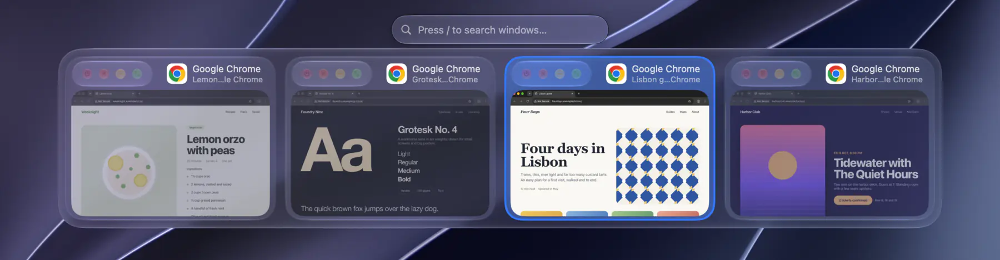

### Command-Tab, with windows

While you hold <kbd>⌘</kbd> and <kbd>Tab</kbd>, DockDoor shows the highlighted app's windows above the built-in app switcher, so you can pick a specific window.

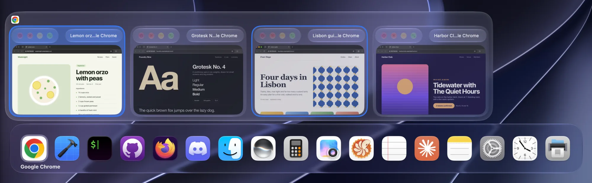

### Folders, widgets and more

<table>
  <tr>
    <td width="50%">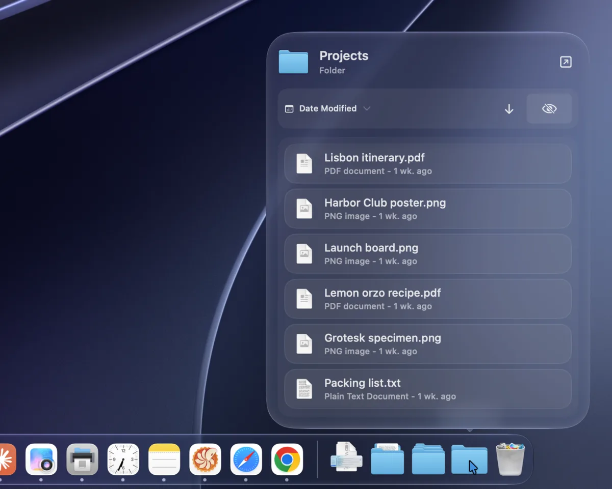 <b>Folder Pop</b> Hover a folder in the Dock to see, sort and open what's inside.</td>
    <td width="50%">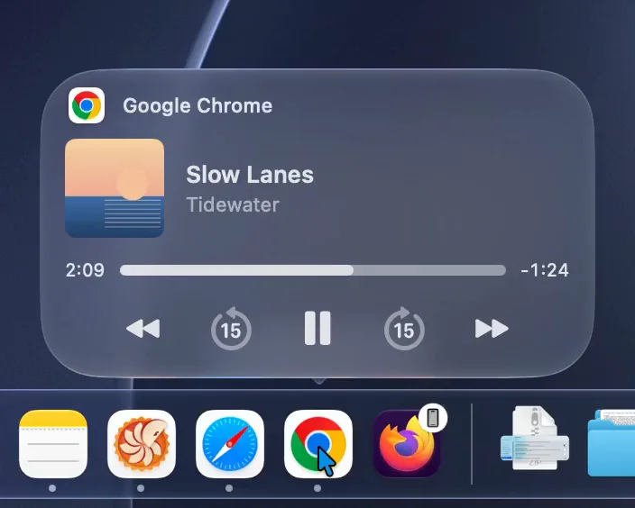 <b>Music controls</b> Hover an app that's playing audio for a player instead of thumbnails, with synced lyrics for Spotify and Apple Music.</td>
  </tr>
  <tr>
    <td width="50%">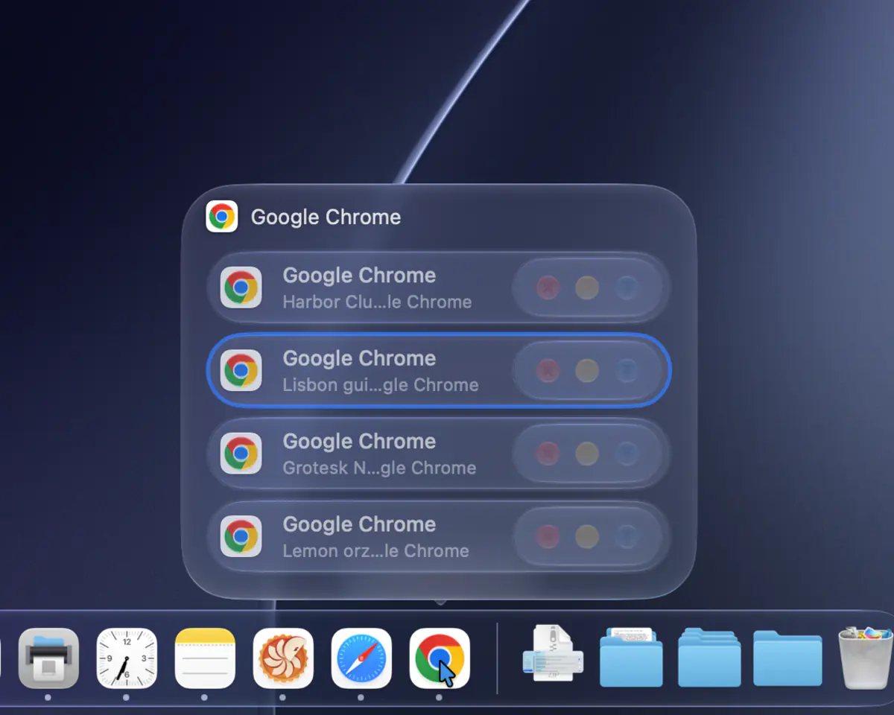 <b>Compact list</b> Show an app's windows as a list of titles, all the time or once it has a lot of them.</td>
    <td width="50%">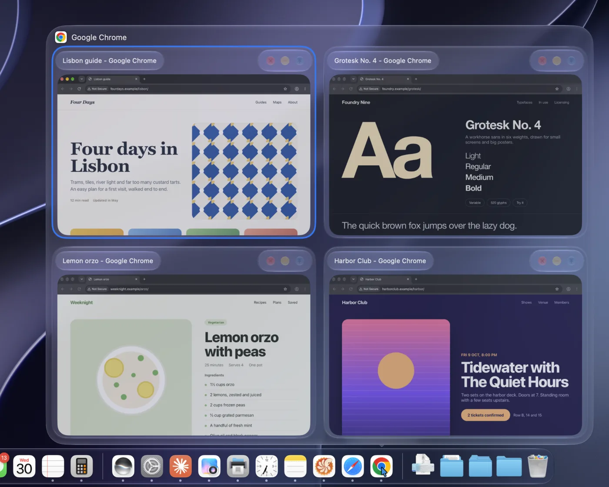 <b>Large previews</b> Make thumbnails bigger to tell similar windows apart.</td>
  </tr>
</table>

Plus:

- **Gestures:** swipe two fingers on a preview to minimize or maximize a window, scroll on a Dock icon to show or hide an app, or shake a preview to minimize everything else.
- **Quick quit:** hold <kbd>⌘</kbd> and right-click a Dock icon to quit the app, or add <kbd>⌥</kbd> to force quit.
- **Calendar:** hover Calendar to see the rest of today's events.
- **Dock Locking:** with more than one display, keep the Dock on the screen you choose.
- **AppleScript and CLI:** control previews, the switcher and windows from scripts. See the [docs](https://dockdoor.net/docs).

### Make it look like yours

Choose Liquid Glass (macOS 26 and later), frosted or clear, and set the preview size, spacing, corners and where the window controls sit.

<table>
  <tr>
    <td width="50%">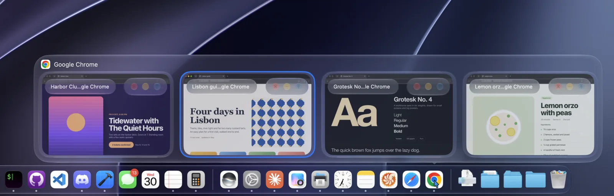</td>
    <td width="50%">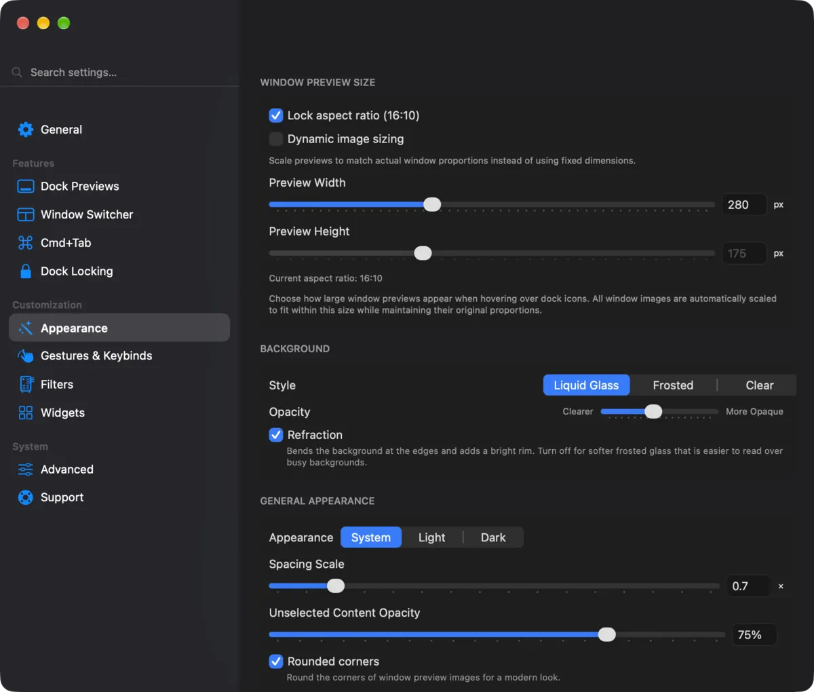</td>
  </tr>
</table>

<a href="#readme-top">Back to top ⬆️</a>

## Privacy

Nothing leaves your Mac. DockDoor has no servers to send anything to: no analytics, no usage tracking and no crash reporters. Debug logs are written locally and go nowhere unless you export them yourself.

<a href="#readme-top">Back to top ⬆️</a>

## DockDoor Pro

<a href="https://pro.dockdoor.net">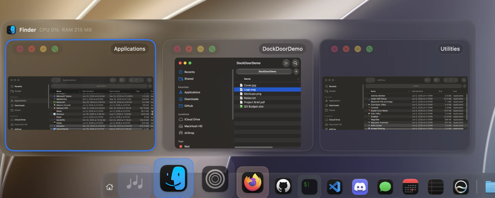</a>

**DockDoor Free has no paywall and never will.** Every feature in this repo is free, forever.

**[DockDoor Pro](https://pro.dockdoor.net)** is a separate paid app from the same developer. It replaces the macOS Dock with its own, and buying it is the best way to support DockDoor Free:

- Spring magnification at your display's full refresh rate
- Folders that fan out, a drag-and-drop file tray with AirDrop, and right-click quick actions
- Liquid Glass, frosted or clear materials, profiles, and a different Dock on every display
- Its own window previews and a full Alt+Tab replacement
- A widget marketplace with clock, weather, battery, now playing and community widgets

$20 one-time for 3 Macs. No subscription, 14-day money-back guarantee. If you use Pro, you don't need DockDoor Free.

<a href="#readme-top">Back to top ⬆️</a>

## Contributing

DockDoor is written almost entirely by one developer, with fixes, features and translations from the open-source community.

- ⭐ [Star it on GitHub](https://github.com/ejbills/DockDoor) to help other people find it
- 🐛 [Report a bug or ask for a feature](https://github.com/ejbills/DockDoor/issues)
- 🌍 [Translate it on Crowdin](https://crowdin.com/project/dockdoor)
- 💬 [Join the Discord](https://discord.gg/TZeRs73hFb)
- ❤️ [Support development](https://dockdoor.net/donate)

<a href="#readme-top">Back to top ⬆️</a>

## License

This project is licensed under the GNU General Public License v3.0 - see the [LICENSE](LICENSE) file for details.

<a href="#readme-top">Back to top ⬆️</a>

