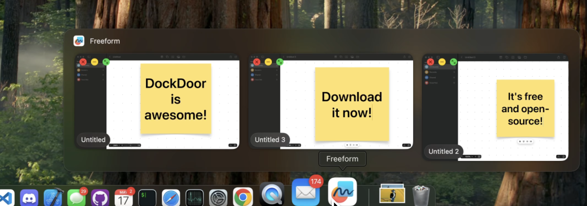
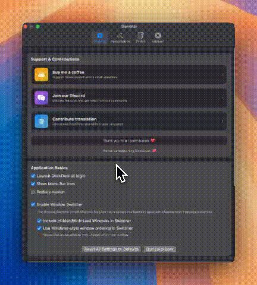

<div align="center">

<h1>DockDoor</h1>
<h2><i>A new way of interacting with the Dock.</i></h2>
</div>

<p align="center">
  
</p>

[](https://github.com/ejbills/DockDoor/releases/latest/download/DockDoor.dmg)

[](https://github.com/ejbills/DockDoor/stargazers)
[](https://github.com/ejbills/DockDoor/network/members)
[](https://github.com/ejbills/DockDoor/issues)
[](https://github.com/ejbills/DockDoor/blob/main/LICENSE)
[](https://github.com/ejbills/DockDoor/graphs/contributors)
[](https://crowdin.com/project/dockdoor)
[](https://dockdoor.net)

**DockDoor** is a macOS application that adds a much-needed feature to your Mac: Dock previews.
Developed with Swift and SwiftUI, it offers seamless integration with macOS. DockDoor is designed for ease of use and intuitive interactions.
As an open-source project, it welcomes contributions from developers to enhance the application’s functionality, performance and user experience.

Minimum macOS version:
- 1.1.5 and older: **macOS 14 Sonoma**
- 1.1.6 and newer: **macOS 13 Ventura**

If you appreciate this application, please consider **donating** to the developer. Any amount is appreciated! [](https://www.buymeacoffee.com/keplercafe)

If you encounter a bug or have a feature request, please **open an issue** on this repository. The developers will do their best to address the bug or fulfill your request!

> [!NOTE]
> You can help translating this application in your own language. This is a crucial step in making DockDoor accessible to everyone, regardless of their knowledge level in English. [](#translating)

## Install

### Manual installation

[Download the latest release here](https://github.com/ejbills/DockDoor/releases/latest/download/DockDoor.dmg). Mount the downloaded file (`DockDoor.dmg`) and drag DockDoor to the `Applications` folder.

> [!NOTE]
> DockDoor is still actively being developed. To ensure you benefit from all the latest features, please keep your copy of the application up to date by enabling automatic updates in the app.

### Using Homebrew

You can also install DockDoor using [Homebrew](https://brew.sh/)! Just type or paste the following command into a Terminal:
```sh
brew install --cask dockdoor
```

## Usage

### Dock Peek feature
Hover over any application’s icon in the Dock to see its open windows.
Each traffic light button you see serves an intuitive function.
> [!TIP]
> Hold **`Option`** (⌥) while clicking the **`Quit`** button to **force quit** the window’s application.
<p align="center">
  
</p>

### Windows-like `Alt` + `Tab` window switcher
With the default settings, hold down `Command` (⌘) and press `Tab` (⇥) repeatedly until the desired window is highlighted. To go back, press `Shift` (⇧) in addition to `Tab`.
Release both keys to switch to the selected window.

#### Customization
- Select one of the initialization keys (`Control`, `Option` or `Command`)
- Click on `Start Recording Keybind`
- Press a single key on your keyboard
- Custom keybind is set!



## Frequently Asked Questions

### How to access DockDoor settings?
If you disabled `Show Menu Bar Icon` in `General`, search for `DockDoor` using the built-in Spotlight or another searching app. Open DockDoor and the settings should open automatically.

If this option is enabled, click on the *door* icon in the menu bar and select `Open Settings` in the contextual menu.

### The application I want to quit does not respond.
You can either wait for the application to become responsive again, or force quit it. To do this, hold **`Option`** (⌥) while clicking the `Quit` button.
 
## Contributing

You can either contribute to DockDoor’s code, or help translating the application or the website.

### DockDoor’s code

#### Prerequisites

- **macOS 13.0** or later.
- **Xcode** installed on your machine.
- Basic knowledge of **Swift** and **SwiftUI**.

#### Setting Up the Project

1. **Fork** the repository.
2. **Clone** your forked repository to your local machine using `git`.
3. **Open** the project in Xcode.
4. **Build** and **run** the project.

#### How to Contribute

Contributions to DockDoor are welcome! Here’s how you can get started:

1. **Branching**
    - Base all new features off of `main`.
    - Create a new branch for each feature or bug fix: `git checkout -b feature/your-feature-name`.
2. **Coding Standards**
    - Follow Swift coding conventions and style guidelines.
    - Aim for clear, concise, and expressive code.
3. **Documentation**
    - Document your code using comments to explain complex logic or functionality.
4. **Testing**
    - Write unit tests for new features or changes.
    - Ensure existing tests pass before submitting a pull request.
5. **Open a pull request**
    - Perform a self-review of your code.

### Translating

Open the following link to contribute by translating DockDoor. You will need to create a Crowdin account, but you can link it to your GitHub account.

https://crowdin.com/project/dockdoor

### Translating the website (https://dockdoor.net)

To enhance web communication, we invite you to help translate the project’s website, https://dockdoor.net, with the following link: https://crowdin.com/project/dockdoor-website.

**But before you begin translating**, please consider the following points:
- The strings contain **basic HTML tags**. It is recommended to have **some familiarity with HTML**. You can find many tutorials online, and HTML is particularly easy to learn.
- As a consequence, please **respect the markup** indicated in the source language. For a word surrounded by `<strong>` tags, add `<strong>` (and `</strong>` to close it) around the equivalent word in your language.
- A few strings contain special codes such as `&#8984;` or `&RightArrowBar;`. If you hover over them on Crowdin in the source language, you can see what character it represents. **The semicolon here is crucial. Do not omit it.**
- Other strings contain `&nbsp;` between words. **These are no-break spaces. They are not substitutable with regular spaces.** Use them as much as needed in the source language.
> [!TIP]
> Click on the tags to paste them directly into your translation. The same process also works for special codes.

- There are a few `<span>` tags (e.g., `<span class='yellow-highlight'>` `</span>`). Copy them **exactly** as they appear in the source language.
- **Escape your quotation marks** using `\` before them! If you don’t, the translations might fail to render.
