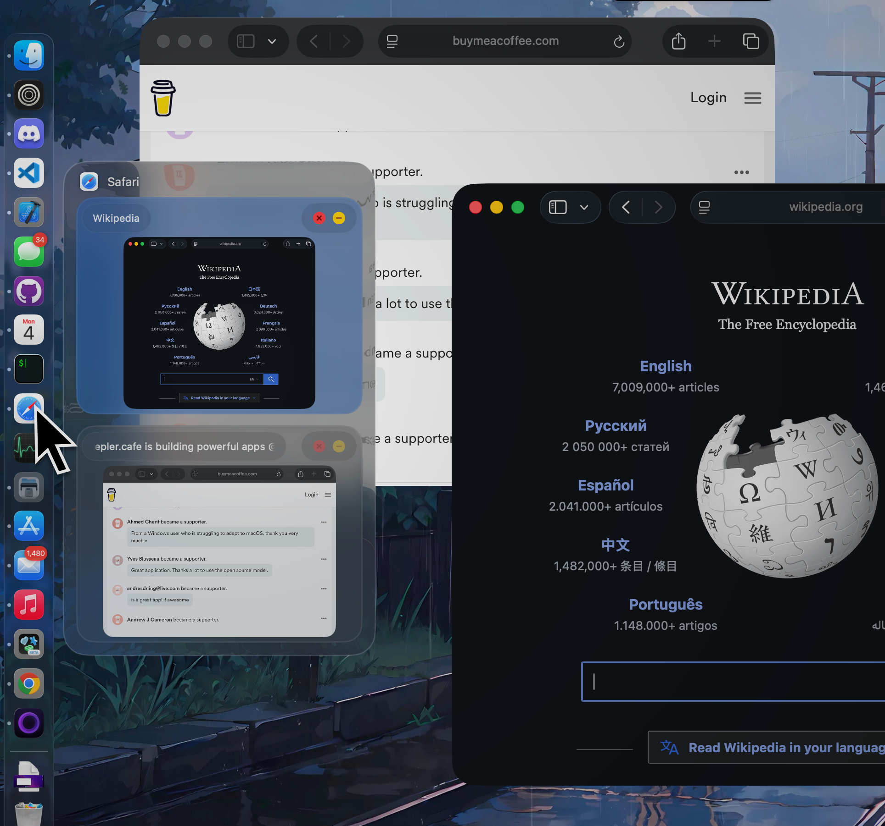

# DockDoor

  
  

  
   
  <em>Dock peeking</em>

  
   
  <em>Window Switcher</em>

  
   
  <em>Cmd-tab icon switcher enhancement</em>

---

For full details, features, and documentation, visit **[dockdoor.net](https://dockdoor.net)**
